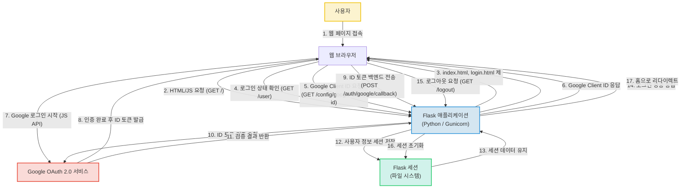

# Unknown Project

## 프로젝트 소개

`Unknown Project` (저장소명: `treevia`)는 Google OAuth 2.0을 통한 사용자 인증 기능을 제공하는 경량 웹 애플리케이션입니다. 프로젝트명에 대한 구체적인 정보가 없어 'Unknown Project'로 명시되었으나, 내부 문서(`README.md` 추정)에 "나무 퀴즈 게임"에 대한 언급이 있는 것으로 보아, 사용자들이 Google 계정으로 로그인하여 나무 관련 퀴즈를 즐길 수 있도록 설계된 서비스로 추정됩니다.

현재는 사용자 인증 및 세션 관리 기능을 중심으로 구현되어 있으며, 향후 퀴즈 게임 로직이 추가될 예정인 최소 기능 제품(MVP) 단계입니다.

*   **저장소 URL**: https://github.com/grassandtree/treevia

## 주요 기능

현재 프로젝트는 다음과 같은 주요 기능을 제공합니다.

*   **Google OAuth 2.0 기반 사용자 인증**: Google 계정을 이용한 안전한 로그인 및 로그아웃 기능을 제공합니다.
*   **사용자 세션 관리**: 로그인한 사용자 정보를 서버 측 세션에 저장하여 상태를 유지합니다.
*   **정적 웹 페이지 서빙**: Flask 백엔드를 통해 HTML, CSS, JavaScript로 구성된 프런트엔드 페이지를 제공합니다.
*   **Docker 기반 컨테이너화**: 애플리케이션의 일관된 빌드 및 배포 환경을 제공합니다.

**추정**: `README.md` 파일에 '나무 퀴즈 게임'이 주요 기능으로 명시되어 있으나, 현재 코드에서는 퀴즈 문제 생성, 답안 처리, 점수 계산 등 핵심 게임 로직의 구현 흔적은 발견되지 않았습니다. 이는 아직 개발이 진행되지 않은 상태로 추정됩니다.

## 프로젝트 구조

[정보 없음]
(자세한 파일 설명은 아래 '핵심 파일 설명' 섹션을 참조하십시오.)

## 핵심 파일 설명

이 프로젝트의 핵심 기능을 구성하는 주요 파일들은 다음과 같습니다.

*   **`main.py`**: 애플리케이션의 메인 엔트리 포인트이자 백엔드 로직을 담당합니다. Flask 앱을 초기화하고, Google OAuth 2.0 인증(로그인, 로그아웃, 콜백 처리) 및 사용자 세션 관리 로직을 구현합니다. 또한, `src/index.html` 및 `src/login.html`과 같은 프런트엔드 HTML 파일을 서빙하는 라우트를 정의하고, 클라이언트 ID를 제공하는 API 엔드포인트도 포함합니다.
*   **`Dockerfile`**: 애플리케이션을 Docker 컨테이너로 빌드하기 위한 명령어들을 정의합니다. Python 3.11-slim 이미지를 기반으로 시스템 패키지와 Python 의존성(`requirements.txt`)을 설치하고, 애플리케이션 코드를 복사하며, Gunicorn을 사용하여 Flask 애플리케이션을 실행하도록 구성합니다. 이를 통해 일관된 배포 환경을 제공합니다.
*   **`requirements.txt`**: Python 프로젝트의 모든 의존성 라이브러리 목록을 정의합니다. `Flask`, `Flask-Session`, `google-auth-oauthlib`, `gunicorn` 등 애플리케이션 구동 및 Google OAuth 기능 구현에 필수적인 패키지들이 포함되어 있습니다.
*   **`src/index.html`**: 애플리케이션의 메인 페이지 HTML 파일입니다. 페이지 로드 시 백엔드의 `/user` API를 호출하여 로그인 상태를 확인하고, 그 결과에 따라 로그인 버튼 또는 사용자 프로필 정보를 동적으로 표시합니다. CSS를 포함하여 기본적인 스타일링도 담당합니다.
*   **`src/login.html`**: Google OAuth를 통해 사용자가 로그인하는 페이지의 HTML 파일입니다. Google Sign-In 라이브러리를 로드하고, 백엔드의 `/config/google-client-id` API로부터 클라이언트 ID를 받아와 구글 로그인 버튼을 렌더링합니다. 로그인 성공 시 구글로부터 받은 토큰을 백엔드의 `/auth/google/callback` 엔드포인트로 전송하는 스크립트가 포함되어 있습니다.
*   **`run.sh` / `run.bat`**: 로컬 개발 환경에서 Flask 애플리케이션을 편리하게 실행하기 위한 쉘 스크립트(Windows용 `.bat` 파일 포함)입니다. 가상 환경을 활성화하고 `python -m flask --app main run --debug` 명령어를 사용하여 디버그 모드로 개발 서버를 시작하는 역할을 합니다.
*   **`README.md` (추정)**: 프로젝트의 전반적인 개요, 목적, 현재 및 향후 주요 기능, 사용 방법, 개발 환경, 그리고 로컬 및 Docker 환경에서의 실행 방법 등을 상세하게 설명하는 핵심 문서입니다. 프로젝트의 청사진과 사용자/개발자 가이드를 제공합니다.
*   **`CHANGELOG.md` (추정)**: 프로젝트의 변경 이력과 버전별 업데이트 내용을 기록하는 파일입니다. 현재는 초기 프로젝트 설정 및 파일 생성 이력이 기록되어 있어, 프로젝트의 시작 시점과 초기 구성을 파악하는 데 도움을 줍니다.

## 기술 스택

### Frontend
*   **HTML5 / CSS3**: 웹 표준 마크업 및 스타일링을 통해 사용자 인터페이스를 구축하고 웹 접근성 기본기를 다지는 데 활용됩니다.
*   **JavaScript (Vanilla JS)**: 클라이언트 측 상호작용 및 비동기 통신을 구현하여 동적인 웹 페이지를 만드는 데 사용됩니다.
*   **Google Identity Services (GSI) Client Library**: 구글 OAuth 2.0 로그인을 클라이언트 측에서 처리하여 외부 인증 시스템 연동 경험을 쌓는 데 활용됩니다.

### Backend
*   **Python 3.11 (Dockerfile에 명시)**: 범용적이고 강력한 언어로 서버 로직을 구현하고 백엔드 개발의 기반을 다지는 데 사용됩니다.
*   **Flask**: 가볍고 유연한 웹 프레임워크를 사용하여 RESTful API를 빠르고 효율적으로 개발하는 데 활용됩니다.
*   **Flask-Session**: 서버 측 세션 관리를 구현하여 사용자 상태를 안전하게 유지하는 방법을 이해하는 데 사용됩니다.
*   **google-auth-oauthlib**: 구글 OAuth 2.0을 통해 사용자 인증 및 권한 부여를 안전하게 처리하는 방법을 배우는 데 활용됩니다.
*   **Gunicorn**: 프로덕션 환경에서 Python 웹 애플리케이션을 안정적으로 서비스하기 위한 WSGI 서버 구성 및 관리 능력을 보여줍니다.

### DevOps
*   **Docker**: 애플리케이션과 그 의존성을 컨테이너화하여 개발, 테스트, 배포 환경의 일관성을 확보하는 데 활용됩니다.
*   **Dockerfile**: Docker 이미지를 정의하여 애플리케이션 배포 과정을 자동화하고 표준화하는 데 사용됩니다.
*   **Git / GitHub**: 버전 관리 시스템을 활용하여 코드 변경 이력을 관리하고 협업하는 기본 능력을 보여줍니다.
*   **Linux**: Docker 이미지 빌드 및 실행 환경 이해를 통한 운영체제 기본 지식을 나타냅니다.

### External Services
*   **Google Cloud Platform (OAuth 2.0)**: 클라우드 기반 인증 서비스를 연동하여 보안 및 사용자 관리 기능을 구현하는 경험을 제공합니다.

### Database
*   **파일 시스템**: Flask-Session을 사용하여 세션 데이터를 파일로 저장하는 간단한 방법을 익혀 데이터 저장 방식의 기초를 이해하는 데 활용됩니다.

## 시스템 아키텍처

이 프로젝트는 Python Flask를 기반으로 하는 경량 웹 애플리케이션으로, Google OAuth 2.0을 통한 사용자 인증 기능을 제공합니다. 프론트엔드는 HTML, CSS, JavaScript로 구성되며, 백엔드에서 정적 파일을 서빙하고 API 요청을 처리합니다. 사용자 세션은 서버의 파일 시스템에 저장되어 관리되며, 전체 애플리케이션은 Docker 컨테이너로 패키징되어 Gunicorn을 통해 안정적으로 서비스됩니다.

이는 간단한 인증 기능을 갖춘 웹 서비스를 효율적으로 구축하고 배포하는 기본적인 아키텍처 패턴을 보여주며, 최소한의 자원으로 MVP(Minimum Viable Product)를 구현하기에 적합합니다.

### 핵심 포인트

*   **Flask 기반의 단일 서버 아키텍처**: 정적 파일 서빙과 API 로직을 모두 처리합니다.
*   **Google OAuth 2.0 활용**: 외부 인증 시스템 연동을 구현하여 사용자 인증을 처리합니다.
*   **파일 시스템 기반 세션 관리**: 사용자 세션은 서버의 로컬 파일 시스템에 저장되는 방식을 채택하여 간단한 세션 관리를 보여줍니다.
*   **Docker 및 Gunicorn**: 애플리케이션을 컨테이너화하고 Gunicorn으로 프로덕션 환경에 최적화된 배포를 가능하게 합니다.
*   **MVP 형태**: 별도의 영구 데이터베이스 없이 기본적인 인증 및 세션 관리 기능만을 제공하는 최소 기능 제품(MVP) 형태입니다.

## 실행 방법

추가 작성 필요.

**추정**: 로컬 개발 환경에서는 `run.sh` 또는 `run.bat` 스크립트를 실행하여 Flask 개발 서버를 시작할 수 있습니다.
Docker 환경에서는 `Dockerfile`을 사용하여 이미지를 빌드하고 실행할 수 있습니다. `docker-compose.yml` 파일이 문서에 언급되었으나 현재 존재하지 않으므로, 이 부분을 개선해야 합니다.

일반적인 실행 흐름은 다음과 같습니다:

1.  **환경 설정**: `.env` 파일 등에 Google OAuth 클라이언트 ID 및 시크릿을 설정합니다.
2.  **의존성 설치**: `pip install -r requirements.txt`
3.  **로컬 실행**:
    *   `./run.sh` 또는 `run.bat` 실행
    *   또는 `python -m flask --app main run --debug` 직접 실행
4.  **Docker 실행 (추정)**:
    *   `docker build -t your-app-name .`
    *   `docker run -p 5000:5000 your-app-name`
    *   **Docker Compose (추정)**: `docker-compose.yml` 파일이 있다면 `docker-compose up --build` 명령어를 사용할 수 있습니다.

## 기술 선택 이유

*   **Python 3.11**: 범용성과 생산성이 뛰어나며, 다양한 라이브러리 생태계를 활용하여 빠르고 안정적인 백엔드를 구축하기에 적합합니다.
*   **Flask**: 가볍고 유연한 마이크로 웹 프레임워크로, 빠르고 효율적인 RESTful API 개발 및 소규모 프로젝트에 적합합니다.
*   **Flask-Session**: Flask 애플리케이션에서 서버 측 세션 관리를 쉽게 구현할 수 있도록 도와주어 사용자 상태를 안전하게 유지하는 데 용이합니다.
*   **google-auth-oauthlib**: Google OAuth 2.0을 Python 백엔드에서 간편하게 연동하여 사용자 인증 및 권한 부여를 안전하게 처리할 수 있도록 지원합니다.
*   **Gunicorn**: 프로덕션 환경에서 Python 웹 애플리케이션을 안정적이고 효율적으로 서비스하기 위한 WSGI HTTP 서버로, 동시 요청 처리 및 성능 최적화에 유리합니다.
*   **HTML5 / CSS3 / JavaScript**: 웹 표준 기술로, 브라우저 호환성이 높고 별도의 프레임워크 없이도 동적인 사용자 인터페이스를 구축할 수 있습니다.
*   **Google Identity Services (GSI) Client Library**: 클라이언트 측에서 Google 로그인을 쉽게 구현하고 사용자 경험을 개선할 수 있도록 Google이 제공하는 공식 라이브러리입니다.
*   **Docker / Dockerfile**: 애플리케이션과 모든 의존성을 컨테이너화하여 개발, 테스트, 배포 환경 간의 일관성을 보장하고 관리 오버헤드를 줄일 수 있습니다.
*   **Git / GitHub**: 소스 코드의 버전 관리를 효율적으로 수행하고, 팀 협업을 용이하게 하며, 코드 변경 이력을 투명하게 관리할 수 있도록 합니다.
*   **Google Cloud Platform (OAuth 2.0)**: Google 생태계의 신뢰성 높은 인증 서비스를 활용하여 보안을 강화하고 사용자 관리 부담을 줄일 수 있습니다.
*   **파일 시스템 (Flask-Session 저장소)**: 복잡한 데이터베이스 설정 없이 간단하게 세션 데이터를 저장하여 MVP 단계에서 빠르게 기능을 구현하는 데 적합합니다.

## 개선 방향

현재 프로젝트의 분석 결과와 추정 내용을 바탕으로 다음과 같은 개선 방향을 제안합니다.

*   **퀴즈 게임 로직 구현**: '나무 퀴즈 게임'이라는 프로젝트의 핵심 목적을 달성하기 위해, 퀴즈 문제 생성, 답안 처리, 점수 계산, 정답 해설 등 구체적인 게임 로직을 구현해야 합니다.
*   **영구 데이터 저장을 위한 데이터베이스 연동**: 현재 사용자 세션만 파일 시스템에 저장되므로, 퀴즈 문제, 사용자 점수, 사용자 프로필 등 영구적인 데이터 저장을 위해 데이터베이스(예: SQLite, PostgreSQL 등)를 연동하는 것이 필요합니다.
*   **프런트엔드 로그인 후 처리 로직 명확화 및 사용자 경험 개선**: 구글 로그인 성공 후 `src/login.html`에서 `main.py`의 응답을 어떻게 처리하고 `src/index.html`과 연동되는지 명확히 정의하고, 사용자에게 일관되고 직관적인 피드백을 제공하도록 프런트엔드 로직을 개선해야 합니다. 예를 들어, 로그인 성공 시 메인 페이지로 리다이렉션되도록 명확히 구현할 수 있습니다.
*   **`docker-compose.yml` 파일 추가 및 문서화**: `README.md`에 `Docker Compose로 실행` 섹션이 명시되어 있는 만큼, 실제 `docker-compose.yml` 파일을 프로젝트에 추가하고 관련 사용법을 문서화하여 Docker 기반 개발 및 배포 편의성을 높여야 합니다.
*   **환경 변수 관리 강화**: 클라이언트 ID와 같은 민감한 정보는 `.env` 파일이나 Docker 환경 변수 등을 통해 안전하게 관리하고, 배포 환경별 설정을 유연하게 적용할 수 있도록 개선해야 합니다.
*   **오류 처리 및 로깅**: 애플리케이션의 안정성을 높이기 위해 적절한 오류 처리 로직과 로깅 시스템을 도입하여 문제 발생 시 진단 및 해결을 용이하게 해야 합니다.
*   **정적 파일 캐싱 및 CDN 연동**: 프런트엔드 성능 개선을 위해 정적 파일 캐싱 전략을 도입하거나, 필요 시 CDN(Content Delivery Network)을 연동하는 것을 고려할 수 있습니다.