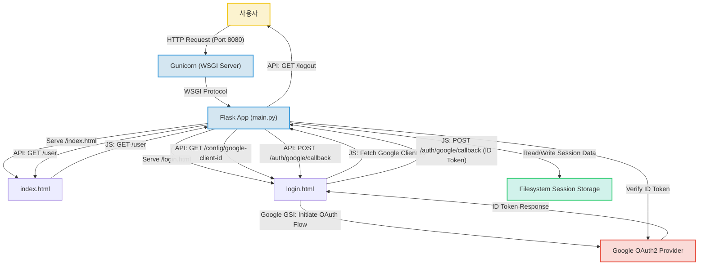

# Unknown Project (treevia)

본 프로젝트는 Python Flask 기반의 경량 웹 애플리케이션으로, Google OAuth2를 활용한 사용자 인증 시스템을 구현했습니다. 저장소명은 `treevia`이며, 최종적으로는 사용자 친화적인 퀴즈 게임(예: 나무 사진을 보고 나무의 이름을 맞추는 게임)을 목표로 하는 것으로 추정됩니다. 현재는 사용자 인증 및 세션 관리 기능에 초점을 맞추고 있습니다.

## 주요 기능

*   **Google OAuth2 기반 사용자 인증**: Google 계정을 통해 안전하게 로그인하고 사용자 정보를 가져옵니다.
*   **사용자 세션 관리**: 로그인한 사용자의 세션을 서버 측에서 효율적으로 관리하여 로그인 상태를 유지합니다.
*   **동적인 UI 업데이트**: 클라이언트 측 JavaScript를 활용하여 사용자의 로그인 상태에 따라 UI를 동적으로 변경합니다.
*   **컨테이너화된 배포 환경**: Docker를 사용하여 애플리케이션을 컨테이너화하고, `gunicorn`을 통해 안정적으로 서비스를 제공할 수 있습니다.
*   **퀴즈 게임 기능 (미구현)**: '나무 사진을 보고 나무의 이름을 맞춰보세요. (TBD)'와 같이 퀴즈 게임에 대한 상세 기능이 'TBD (To Be Developed)'로 명시되어 있으며, 현재 코드에는 이 퀴즈 게임 자체를 구현하는 로직은 포함되어 있지 않습니다. 프로젝트의 핵심 목적이 아직 미구현 상태입니다.

## 프로젝트 구조 (추정)

명시적인 디렉토리 구조 정보는 없지만, 제공된 파일 목록을 바탕으로 일반적인 Flask 프로젝트의 구조를 추정할 수 있습니다.

```
.
├── main.py                 # Flask 애플리케이션 엔트리 포인트
├── requirements.txt        # Python 의존성 목록
├── Dockerfile              # Docker 컨테이너 정의 파일
├── devserver.sh            # 개발 서버 실행 스크립트
└── src/
    ├── index.html          # 메인 페이지 프론트엔드
    └── login.html          # 로그인 페이지 프론트엔드
```

## 핵심 파일 설명

*   `main.py`: Flask 애플리케이션의 핵심 엔트리 포인트입니다. 모든 라우트(URL 경로)를 정의하고, HTML 파일 서빙, Google OAuth2 콜백 처리, 사용자 세션 관리, 로그인 상태 및 사용자 정보 조회 API를 구현합니다. 프로젝트의 백엔드 로직을 담당합니다.
*   `src/index.html`: 애플리케이션의 메인 페이지 프론트엔드 파일입니다. 사용자 로그인 상태에 따라 '로그인' 버튼 또는 '환영합니다, [사용자 이름]님!' 메시지와 프로필 사진을 동적으로 표시합니다. JavaScript를 사용하여 백엔드의 `/user` API와 통신하여 로그인 상태를 확인하고 UI를 업데이트합니다.
*   `src/login.html`: 구글 로그인 처리를 위한 프론트엔드 파일입니다. Google Sign-In (GSI) 라이브러리를 로드하고 초기화하여 구글 로그인 버튼을 렌더링합니다. 백엔드에서 Google Client ID를 비동기적으로 가져와 GSI 설정에 사용하며, 사용자가 구글 로그인을 완료하면 토큰을 백엔드의 `/auth/google/callback` 엔드포인트로 전송하는 로직을 (추정) 포함합니다.
*   `Dockerfile`: 애플리케이션을 컨테이너화하기 위한 정의 파일입니다. Python 3.11 환경을 설정하고, 필요한 시스템 및 Python 의존성을 설치하며, 애플리케이션 코드를 복사하고, `gunicorn`을 사용하여 Flask 애플리케이션을 안정적으로 실행하도록 구성합니다.
*   `requirements.txt`: 프로젝트가 의존하는 모든 Python 라이브러리 목록을 포함합니다. Flask, Flask-Session, Google 인증 관련 라이브러리 (`google-auth-oauthlib`), Gunicorn 등이 명시되어 있어, 개발 환경 설정 및 배포 시 필요한 패키지를 자동으로 설치할 수 있게 합니다.
*   `devserver.sh`: Linux/macOS 환경에서 개발 서버를 편리하게 실행하기 위한 셸 스크립트입니다. 가상 환경을 활성화하고 Flask 애플리케이션을 디버그 모드로 실행하도록 설정합니다.

## 기술 스택

*   **Frontend**:
    *   **HTML**: 웹 페이지 구조화 및 컨텐츠 제공의 기본 기술을 익혔습니다.
    *   **CSS**: 웹 페이지의 시각적 디자인과 레이아웃을 구성하는 능력을 보여줍니다.
    *   **JavaScript**: 클라이언트 측에서 동적인 웹 페이지 동작과 서버와의 비동기 통신을 구현했습니다.
    *   **Google Sign-In (GSI) Library**: 널리 사용되는 외부 인증 솔루션을 통합하여 사용자 인증 기능을 구현했습니다.
*   **Backend**:
    *   **Python**: 직관적인 문법으로 빠른 개발이 가능하며, 다양한 라이브러리를 활용할 수 있습니다.
    *   **Flask**: 경량 웹 프레임워크로 소규모 프로젝트에 적합하며, 핵심 기능에 집중하여 개발할 수 있습니다.
    *   **Flask-Session**: 서버 측에서 사용자 세션을 효율적으로 관리하여 로그인 상태를 유지하는 기능을 구현했습니다.
    *   **Google OAuth2 (Backend)**: 안전한 방식으로 외부 서비스(Google)의 사용자 정보를 검증하고 관리하는 방법을 이해했습니다.
*   **DevOps**:
    *   **Docker**: 애플리케이션을 컨테이너화하여 개발 환경과 운영 환경의 일관성을 확보하고 배포를 용이하게 했습니다.
    *   **Gunicorn**: Flask 애플리케이션을 안정적이고 성능 좋게 서비스하기 위한 WSGI 서버를 구성했습니다.
*   **Database**:
    *   **Filesystem**: Flask-Session을 이용한 파일 시스템 기반 세션 저장 방식으로, 경량 프로젝트에서 별도 데이터베이스 없이 세션 관리를 구현했습니다.

## 시스템 아키텍처

이 시스템은 Python Flask 백엔드와 HTML/CSS/JavaScript 프론트엔드로 구성된 단일 웹 애플리케이션입니다. 사용자 인증을 위해 Google OAuth2를 통합하며, Flask-Session을 이용하여 사용자 세션을 파일 시스템에 저장합니다. 애플리케이션은 Docker를 사용하여 컨테이너화되고, Gunicorn WSGI 서버를 통해 배포되어 안정적인 서비스를 제공합니다.



## 실행 방법

본 프로젝트는 개발 환경과 컨테이너 환경 모두에서 실행할 수 있습니다.

### 1. 로컬 개발 서버 실행

1.  **Python 환경 설정**:
    Python 3.11 이상이 설치되어 있어야 합니다.
2.  **의존성 설치**:
    프로젝트 루트 디렉토리에서 다음 명령어를 실행하여 필요한 Python 라이브러리를 설치합니다.
    ```bash
    pip install -r requirements.txt
    ```
3.  **환경 변수 설정**:
    Google OAuth2 Client ID 및 Client Secret을 환경 변수로 설정해야 합니다.
    *   `GOOGLE_CLIENT_ID`: Google Cloud Console에서 발급받은 클라이언트 ID
    *   `GOOGLE_CLIENT_SECRET`: Google Cloud Console에서 발급받은 클라이언트 시크릿
    *   `SECRET_KEY`: Flask 세션 관리를 위한 시크릿 키 (임의의 문자열)
    *   `FLASK_SESSION_TYPE`: 세션 저장 방식 (예: `filesystem`)
    *   `FLASK_SESSION_FILE_DIR`: 세션 파일 저장 디렉토리 (예: `./flask_session`)
    ```bash
    export GOOGLE_CLIENT_ID="YOUR_GOOGLE_CLIENT_ID"
    export GOOGLE_CLIENT_SECRET="YOUR_GOOGLE_CLIENT_SECRET"
    export SECRET_KEY="YOUR_SUPER_SECRET_KEY"
    export FLASK_SESSION_TYPE="filesystem"
    export FLASK_SESSION_FILE_DIR="./flask_session"
    ```
4.  **개발 서버 실행**:
    `devserver.sh` 스크립트를 사용하여 Flask 개발 서버를 실행합니다.
    ```bash
    bash devserver.sh
    ```
    (추정) 서버는 기본적으로 `http://127.0.0.1:8080`에서 실행될 것입니다.

### 2. Docker를 이용한 컨테이너 실행

1.  **Docker 설치**:
    시스템에 Docker가 설치되어 있어야 합니다.
2.  **이미지 빌드**:
    프로젝트 루트 디렉토리에서 다음 명령어를 실행하여 Docker 이미지를 빌드합니다.
    ```bash
    docker build -t treevia-app .
    ```
3.  **컨테이너 실행**:
    빌드된 이미지를 사용하여 컨테이너를 실행합니다. 이때 필요한 환경 변수들을 `-e` 옵션으로 전달합니다.
    ```bash
    docker run -p 8080:8080 \
      -e GOOGLE_CLIENT_ID="YOUR_GOOGLE_CLIENT_ID" \
      -e GOOGLE_CLIENT_SECRET="YOUR_GOOGLE_CLIENT_SECRET" \
      -e SECRET_KEY="YOUR_SUPER_SECRET_KEY" \
      -e FLASK_SESSION_TYPE="filesystem" \
      -e FLASK_SESSION_FILE_DIR="/tmp/flask_session" \
      treevia-app
    ```
    (추정) 애플리케이션은 `http://localhost:8080`에서 접근할 수 있습니다.

## 기술 선택 이유

*   **Python**: 직관적인 문법으로 빠른 개발이 가능하며, 다양한 라이브러리를 활용하여 확장성을 높일 수 있습니다.
*   **Flask**: 경량 웹 프레임워크로 소규모 프로젝트에 적합하며, 핵심 기능에 집중하여 빠르고 효율적인 개발을 가능하게 합니다.
*   **Flask-Session**: Flask 애플리케이션에서 사용자 세션을 쉽게 관리할 수 있도록 해주며, 다양한 저장 방식을 지원하여 유연성을 제공합니다.
*   **Google OAuth2**: 널리 사용되는 안전한 외부 인증 방식으로, 사용자에게 익숙한 로그인 경험을 제공하고 개발 부담을 줄여줍니다.
*   **HTML/CSS/JavaScript**: 웹 표준 기술로, 별도의 프레임워크 없이도 동적이고 반응형 웹 페이지를 구현할 수 있습니다.
*   **Google Sign-In (GSI) Library**: Google 로그인을 간편하게 통합할 수 있는 클라이언트 측 라이브러리로, 구현 시간을 단축하고 안정적인 사용자 경험을 제공합니다.
*   **Docker**: 애플리케이션과 모든 의존성을 하나의 컨테이너로 패키징하여 개발, 테스트, 배포 환경의 일관성을 보장하고 관리 효율성을 높입니다.
*   **Gunicorn**: Python 웹 애플리케이션을 위한 안정적이고 성능 좋은 WSGI 서버로, Flask 애플리케이션을 프로덕션 환경에서 효율적으로 서비스할 수 있도록 돕습니다.
*   **Filesystem (Flask-Session)**: 별도의 데이터베이스 설정 없이도 세션 데이터를 저장할 수 있어, 경량 프로젝트의 개발 초기 단계에서 빠르게 세션 관리를 구현할 수 있습니다.

## 개선 방향

현재 프로젝트는 사용자 인증 시스템에 중점을 두고 있으며, 다음과 같은 방향으로 개선 및 확장이 가능합니다.

*   **퀴즈 게임 로직 구현**: 프로젝트의 핵심 목표로 추정되는 퀴즈 게임 로직을 구현해야 합니다.
    *   문제 데이터 관리 (예: 나무 이미지, 정답, 오답 보기)
    *   게임 진행 로직 (문제 출제, 정답 확인, 점수 계산)
    *   게임 결과 표시 및 랭킹 시스템
*   **영구 데이터베이스 도입**: 현재 세션 정보만 파일 시스템에 저장되고 있어, 서버 재시작 시 정보가 유실될 수 있습니다. 사용자 정보(프로필, 퀴즈 점수, 학습 진행도 등)를 영구적으로 저장하기 위해 PostgreSQL, MySQL, SQLite 등의 관계형 데이터베이스나 MongoDB, Redis 등의 NoSQL 데이터베이스를 연동하는 것을 고려해야 합니다.
*   **프론트엔드 프레임워크 도입 (추정)**: 현재 프론트엔드는 순수 HTML, CSS, JavaScript로 구성되어 있습니다. 퀴즈 게임과 같은 복잡한 UI나 상태 관리가 필요한 경우, React, Vue, Angular 등의 프론트엔드 프레임워크를 도입하여 개발 효율성과 유지보수성을 높일 수 있습니다.
*   **보안 강화**:
    *   CSRF (Cross-Site Request Forgery) 보호 추가
    *   API 요청에 대한 적절한 권한 부여 및 인증 확인 강화
    *   환경 변수 관리 (예: `.env` 파일 또는 Docker Secrets)
*   **테스트 코드 작성**: 단위 테스트, 통합 테스트 등을 작성하여 코드의 안정성을 확보하고 향후 기능 추가 시 회귀를 방지합니다.
*   **배포 자동화**: CI/CD 파이프라인을 구축하여 코드 변경 사항이 자동으로 테스트되고 배포될 수 있도록 합니다.